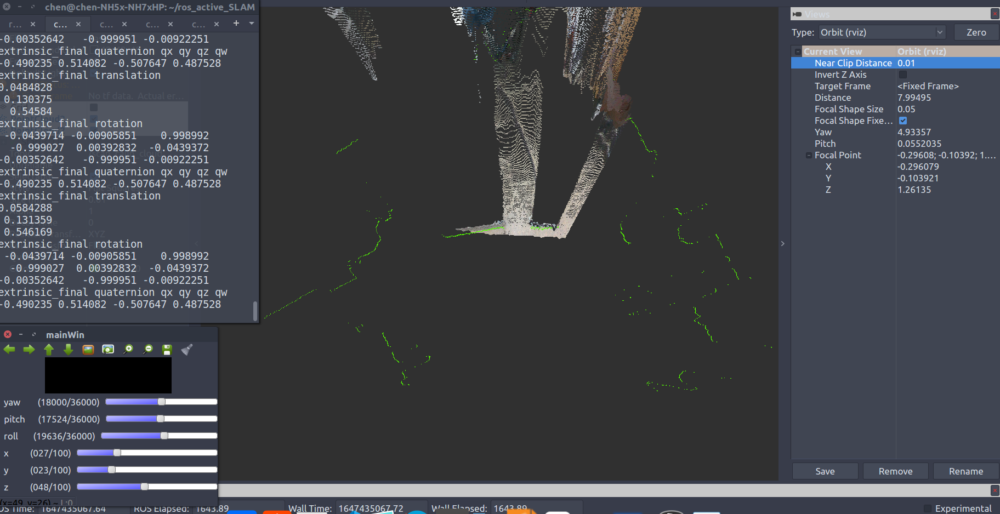
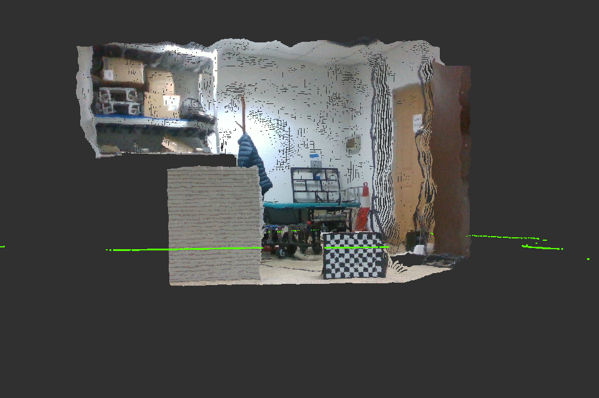

## 工具系列：单线激光雷达和深度相机标定

### 1 依赖

下列为个人测试环境

```
ros
pcl 1.9
eigen 3.3.1
opencv 3.4
yaml-cpp 0.7.0
```

### 2 使用方法

1. 使用`rosbag`采集一段静止数据，至少包含以下信息：

   + `/camera/color/image_raw`：深度相机彩色图像
   + `/camera/aligned_depth_to_color/image_raw`：深度相机深度图像
   + `/scan`：单线激光雷达信息

2. 对深度相机中RGB相机进行内参标定，将内参按照相应格式填入`RGBD2PointCloud/config/config.yaml`中，如下所示：

   ```yaml
   distortion_model: plumb_bob
   D: [9.2615504465028850e-02, -1.8082438825995681e-01, -6.5484100374765971e-04, -3.5829351558557421e-04, 0.000000]
   K: [6.0970550296798035e+02, 0.000000, 3.1916667152289227e+02, 0.000000, 6.0909579671294716e+02, 2.3558360480225772e+02,0.000000, 0.000000, 1.000000]
   
   Factor: 0.001
   ```

   其中，Factor表示深度尺度因子，如`realsense d4355`系列的因子就是`1/1000=0.001`

3. 开启`roscore`，并同时执行下面两个程序，

   + `scan2pointcloud_node`：将单线激光由`sensor_msgs/LaserScan`类型转化为`sensor_msgs/PointCloud2`类型，并通过可视化检查。注意，这里的`frame_id`为`base_scan`，生成的pcd文件存储在`Scan2PointCloud/pcd`下。可在程序中修改激光高度。
   + ` convert_node`：将RGBD图像转化为`sensor_msgs/PointCloud2`类型，并通过可视化检查。注意，这里的`frame_id`为`rgbd`，生成的pcd文件存储在`RGBD2PointCloud/pcd`下

   ```shell
   roscore
   ./build/tools/Scan2PointCloud/scan2pointcloud_node
   ./build/tools/RGBD2PointCloud/convert_node 
   ```

4. 找出对应的pcd文件，将地址填入`CameraScanCalib/config/config.yaml`

   ```bash
   rgbd_cloud: "/home/chen/ros_active_SLAM/src/tools/RGBD2PointCloud/pcd/1647426177.828866838.pcd"
   scan_cloud: "/home/chen/ros_active_SLAM/src/tools/Scan2PointCloud/pcd/1647426176.507907915.pcd"
   ```

   并填入估算的变换初值（尺子测量得到，注意坐标系）：

   ```yaml
   header:
     frame_id: base_scan
     child_frame_id: rgbd
   transform:
     rotation:
       x: -0.51422
       y: 0.468108
       z: -0.481214
       w: 0.533747
     translation:
       x: 0.109716
       y: -0.093383
       z: 0.275872
   ```

5. 使用`calib_node`进行矫正：

   ```shell
   rviz
   ./build/tools/CameraScanCalib/calib_node
   ```

   通过调整进度条修正激光在图像中的位置，使两者进行对齐，完成标定。

   

   

